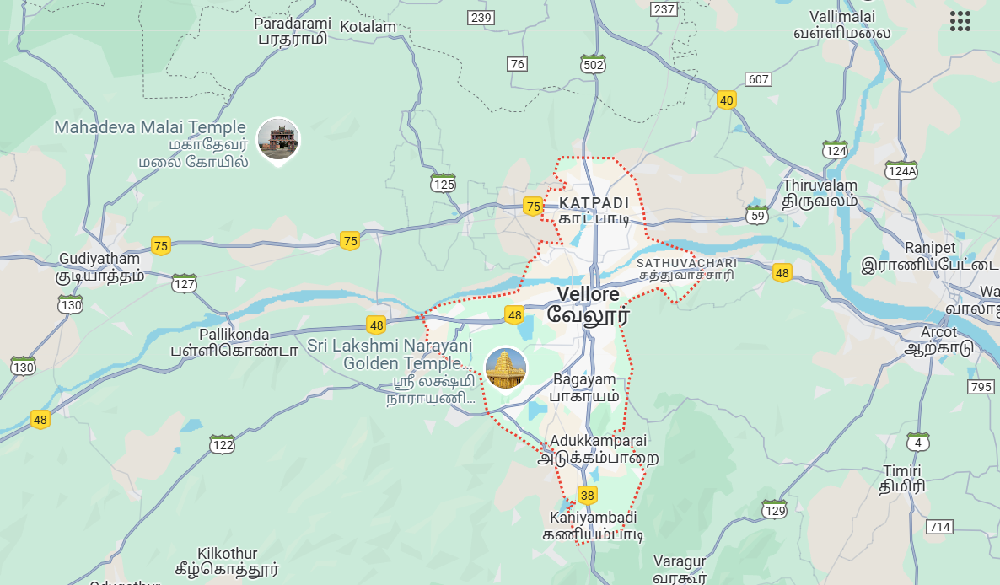

# Ex04 Places Around Me
## Date: 22-04-2025

## AIM
To develop a website to display details about the places around my house.

## DESIGN STEPS

### STEP 1
Create a Django admin interface.

### STEP 2
Download your city map from Google.

### STEP 3
Using ```<map>``` tag name the map.

### STEP 4
Create clickable regions in the image using ```<area>``` tag.

### STEP 5
Write HTML programs for all the regions identified.

### STEP 6
Execute the programs and publish them.

## CODE

map.html
```
<html>
    <head>
        <title>MyCity</title>
    </head>
    <body>
        <h1 align="center">
            <b>Vellore</b>
        </h1>
        <h3 align="center">Priyanka S (212224040255)</h3>
        <center>
        
        <map name="MyCity">
            <area shape="rect" title="My Home Town" href="home.html" coords="700,250,850,400" shape="rect">
            <area shape="rect" title="Gandhi Ngar" href="Gandhi Nagar.html" coords="570,230,450,600" shape="rect">
            <area shape="rect" title="Vellore Fort" href="Vellore Fort.html" coords="570,230,900,400" shape="rect">
            <area shape="rect" title="CMC" href="CMC.html" coords="700,250,500,600" shape="rect">
            <area shape="rect" title="VIT" href="VIT.html" coords="700,250,450,600" shape="rect">
        </map>
        </center>
    </body>
</html>
```
home.html
```
<html>
    <body>
        
        <font size="10">
            <li>"Situated in the state of Tamil Nadu, India"</li>
            <li>"It is located on the banks of the Palar River and surrounded by the Javadi Hills in the northeastern part of Tamil Nadu"</li>
        </font>
    </body>
</html>

```
Ghandhi Nagar.html
```
<html>
    <body>
        
        <font size="10">
            <li>"Gandhi Nagar is famous in vellore for many street food and many Theatre and also famous for VIT(vellore institute of technology)"</li>
            <li>"Situated approximately 8 km from the town center, it covers an area of 8 km² and had a population of 21,889 as per the 2011 Census"</li>
        </font>
    </body>
</html>

```
Vellore Fort.html
```
<html>
    <body>
        
        <font size="10">            
            <li>"Vellore Fort is a large 16th-century fort situated in heart of the Vellore city, in the state of Tamil Nadu, India built by the Emperors of Vijayanagara"</li>
            <li>"Vellore Fort was built by Chinna Bommi Yadhava Nayak and Thimma Yadhava Nayak, subordinate chieftains under emperor Sadasiva Raya of the Vijayanagara Empire in the year 1566 CE"</li>
        </font>
    </body>
</html>

```
CMC.html
```
<html>
    <body>
        
        <font size="10">
            <li>"Christian Medical College Vellore widely known as CMC Vellore is a private Christian minority community-run medical college and hospital in Vellore, Tamil Nadu, India"</li>
            <li>"The hospital was founded by Dr. Ida Sophia Scudder in 1900. Ida Scudder was the daughter of second-generation medical missionaries from the Dutch Reformed Church in the United States of America (US) who served in India"</li>
        </font>
    </body>
</html>
```
VIT.html

```
<html>
    <body>
        
        <font size="10">
            <li>"Vellore Institute of Technology or VIT is a private deemed university in Vellore, Tamil Nadu, India"</li>
            <li>"The university has board of management, academic council and Finance committee. G. Viswanathan is the founder-chancellor of VIT and all its sister universities. The campus spans over 372 acres"</li>
        </font>
    </body>
</html>
```
## OUTPUT


## RESULT
The program for implementing image maps using HTML is executed successfully.
